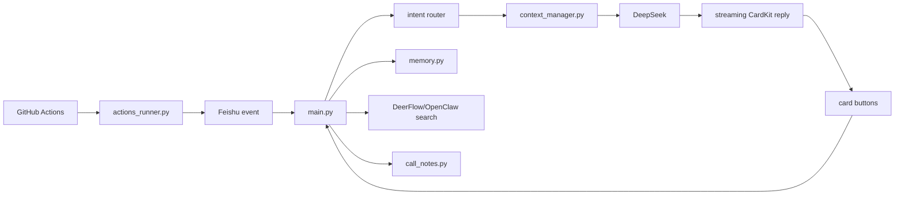

# Feishu Companion Bot

A self-hosted Feishu/Lark companion bot for small private groups. It can reply in real time, keep lightweight long-term memory, summarize activity signals, search external sources through a local tool, and publish compact interactive cards.

The project is designed for personal or relationship-aware assistants, but the default profile is generic. A bot should help when a real person is away; it should not pretend to be that person.

## Features

- Real-time Feishu long-connection listener for group mentions and p2p chats.
- GitHub Actions fallback that polls every few minutes when the local machine is offline.
- Streaming Feishu CardKit replies with buttons: `换个说法`, `继续展开`, `记住这点`, `不要记这个`.
- Local latency traces for each reply: message read, memory search, call-note context, first token, final send.
- Privacy-first memory: JSON storage, profile isolation, local embedding by default, visibility filtering, and agentic write/rerank.
- Optional local signals: foreground app status through AppleScript, DeerFlow/OpenClaw web search, Feishu Minutes/call-note summaries, daily document comments.
- Health check card for Feishu, DeepSeek, memory, Ollama, local search, and local status.

## Architecture



## Quick Start

```bash
python3 -m venv .venv
. .venv/bin/activate
pip install -r requirements.txt
cp .env.example .env
python main.py
```

`DRY_RUN=true` is the default for local testing. Set `DRY_RUN=false` only after Feishu, DeepSeek, and GitHub credentials are configured.

## Profiles

Profiles live in `profiles/` and keep persona, names, aliases, relationship boundaries, and memory keywords out of prompt source code.

- `profiles/default.json`: generic companion bot.
- `profiles/example-couple.json`: relationship assistant template.

Create your own profile:

```bash
cp profiles/example-couple.json profiles/my-profile.json
```

Then set:

```env
PROFILE_ID=my-profile
```

Runtime memory is stored under `memory_data/<PROFILE_ID>/` and is ignored by Git.

## Feishu Setup

Create a Feishu/Lark custom app with Bot enabled, add it to the target chat, and configure:

```env
FEISHU_APP_ID=cli_xxx
FEISHU_APP_SECRET=xxx
FEISHU_CHAT_ID=oc_xxx
FEISHU_BOT_OPEN_ID=ou_xxx
FEISHU_READ_MESSAGES=true
```

Common permissions:

- `im:message`
- `im:message:send_as_bot`
- `im:resource`
- `im:message.reactions:write`
- `im:message:readonly` for card action callbacks and message reads

For card buttons, enable the `card.action.trigger` event in the Feishu Developer Console under Events & Callbacks. Button callbacks are delivered through the same long connection.

Feishu API details should be checked against the official docs: https://open.feishu.cn/document/home/index

## Local Always-On Mode

The included LaunchAgent keeps the bot running after macOS login and wraps it with `caffeinate`:

```bash
mkdir -p ~/Library/LaunchAgents
cp launchd/com.example.feishu-companion-bot.plist ~/Library/LaunchAgents/
launchctl bootstrap gui/$(id -u) ~/Library/LaunchAgents/com.example.feishu-companion-bot.plist
launchctl kickstart -k gui/$(id -u)/com.example.feishu-companion-bot
tail -f bot.log
```

Customize the plist path and label before publishing a packaged deployment.

## GitHub Actions Fallback

`.github/workflows/bot.yml` runs `actions_runner.py` on a schedule. It can post GitHub activity cards and fallback responses when the local long connection is unavailable.

Use Environment secrets, not repository secrets, when the workflow has `environment: feishu`.

GitHub-related environment names use `GH_USERNAME`, `GH_TOKEN`, and `GH_PRIVATE_REPOS` in Actions to avoid reserved `GITHUB_` names.

## Memory

`memory.py` stores structured memories locally:

- default path: `memory_data/<PROFILE_ID>/memories.json`
- default embedding: local hash vectors
- optional embedding: local Ollama with `qwen3-embedding:0.6b`
- `private` memories are never injected into reply prompts
- `owner_only` memories are only available when replying to the owner
- `public_to_target` memories may be used for the target user

Maintenance:

```bash
python main.py --mem-clean-preview
python main.py --mem-clean
```

In Feishu, ask for a memory audit panel to inspect low-confidence, duplicate, or sensitive entries.

## Context Management

Every LLM reply goes through `context_manager.py`. The context is bounded by source:

- recent chat messages
- retrieved memories
- summarized call notes

Each call logs which sections were injected and how many characters were used. This keeps prompt growth predictable and makes debugging easier.

## Latency Tracing

The bot logs local traces similar in spirit to LangSmith spans, without sending data to any external observability service:

```text
[延迟] chat_reply: total=2430ms read_messages=220ms search_memory=80ms call_notes=5ms deepseek_first_token_at=910ms reply_sent_at=2380ms
```

Use these logs to decide whether optimization should target Feishu reads, memory retrieval, call-note loading, model first token latency, or card updates.

## External Search

`external_search.py` supports two local search backends:

- `deerflow`: runs the local DeerFlow embedded Python client and asks it to perform a web-aware research pass. This is the default because it can synthesize the search process into a short conclusion.
- `openclaw`: calls `openclaw infer web search` and summarizes the returned source list.

Typical local configuration:

```env
EXTERNAL_SEARCH_ENABLED=true
EXTERNAL_SEARCH_BACKEND=deerflow
EXTERNAL_SEARCH_FALLBACK_OPENCLAW=true
DEERFLOW_BACKEND_DIR=/Users/you/Code/deer-flow/backend
DEERFLOW_PYTHON=/Users/you/Code/deer-flow/backend/.venv/bin/python
OPENCLAW_CLI=openclaw
```

Use `EXTERNAL_SEARCH_BACKEND=auto` if you want DeerFlow first and OpenClaw fallback regardless of DeerFlow-specific failures. GitHub Actions cannot access your local DeerFlow or OpenClaw process, so scheduled cloud runs should not rely on local search.

## Optional Integrations

- `local_apps.py`: reads the active macOS app/window via AppleScript.
- `external_search.py`: calls local DeerFlow or OpenClaw web search, then summarizes sources into a Feishu table card.
- `call_notes.py`: reads configured Feishu Minutes transcripts and caches short relationship-safe summaries.
- `love_note.py`: comments on new blocks in a configured Feishu Docx/Wiki document instead of editing the document body.

## Safety Notes

- Never commit `.env`, `state.json`, logs, `memory_data/`, call-note caches, or generated QR codes.
- Do not put real addresses, tokens, or private relationship notes in tracked profiles.
- Keep private deployments in untracked local profile files.
- The bot is an assistant, not a replacement for the real person.

## Tests

```bash
.venv/bin/python -m py_compile config.py context_manager.py feishu_api.py main.py memory.py summarizer.py tests/test_regressions.py
.venv/bin/python -m unittest tests.test_regressions
git diff --check
```
