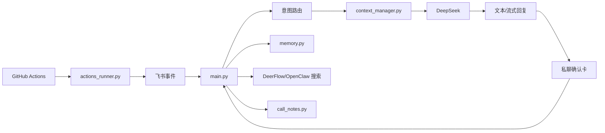

# 飞书陪伴机器人

一个自托管的飞书/Lark 陪伴机器人，适合小群、私聊和长期关系场景。它可以实时回复、维护本地记忆、汇总 GitHub 动态、调用本地搜索工具，并用飞书交互卡片提供按钮操作。

项目默认配置是通用版本。机器人应该在“真实的人暂时不在”时提供帮助，不应该伪装成那个人本人。

## 功能

- 飞书长连接监听：群里被 @ 时回复，私聊可直接回复。
- GitHub Actions 兜底：本机离线时可定时轮询并推送状态。
- 私聊可使用流式飞书卡片回复；群聊使用普通文本气泡流式更新，不把操作按钮塞进群里。
- 本地延迟日志：记录读消息、检索记忆、通话纪要、首 token、最终发送等阶段耗时。
- 隐私优先的记忆系统：按 profile 隔离，默认本地 JSON 存储，支持本地向量和可见性过滤；候选记忆由 DeepSeek 判断后私聊 owner 确认。
- 本地信号源：AppleScript 前台窗口、DeerFlow/OpenClaw 搜索、飞书妙记/通话纪要摘要。
- 服务自检卡片：检查飞书、DeepSeek、记忆库、Ollama、本地搜索和本机状态。
- 本地私有每日任务扩展：公开仓库只保留加载器，具体私有实现不要提交。

## 架构



## 快速开始

```bash
python3 -m venv .venv
. .venv/bin/activate
pip install -r requirements.txt
cp .env.example .env
python main.py
```

默认 `DRY_RUN=true`，只打印不真正发飞书消息。配置好飞书、DeepSeek、GitHub 后再改成 `DRY_RUN=false`。

## Profile

人设、称呼、关系边界、记忆关键词都放在 `profiles/`：

- `profiles/default.json`：通用陪伴机器人。
- `profiles/example-couple.json`：亲密关系助手模板。

创建自己的 profile：

```bash
cp profiles/example-couple.json profiles/my-profile.json
```

然后在 `.env` 设置：

```env
PROFILE_ID=my-profile
```

运行时记忆会写入 `memory_data/<PROFILE_ID>/`，该目录不会提交到 Git。

## 飞书配置

创建飞书/Lark 自建应用，启用机器人，把机器人加入目标群聊，然后配置：

```env
FEISHU_APP_ID=cli_xxx
FEISHU_APP_SECRET=xxx
FEISHU_CHAT_ID=oc_xxx
FEISHU_BOT_OPEN_ID=ou_xxx
FEISHU_READ_MESSAGES=true
```

常用权限：

- `im:message`
- `im:message:send_as_bot`
- `im:resource`
- `im:message.reactions:write`
- `im:message:readonly`

卡片按钮需要在飞书开发者后台的事件订阅里开启 `card.action.trigger`。飞书接口字段要以官方文档为准：https://open.feishu.cn/document/home/index

## 本机常驻

仓库里提供了 LaunchAgent 模板，用 `caffeinate` 保持进程运行：

```bash
mkdir -p ~/Library/LaunchAgents
cp launchd/com.example.feishu-companion-bot.plist ~/Library/LaunchAgents/
launchctl bootstrap gui/$(id -u) ~/Library/LaunchAgents/com.example.feishu-companion-bot.plist
launchctl kickstart -k gui/$(id -u)/com.example.feishu-companion-bot
tail -f bot.log
```

真正部署前要把 plist 里的路径和 label 改成自己的。

## GitHub Actions 兜底

`.github/workflows/bot.yml` 会定时运行 `actions_runner.py`。它能在本机不在线时推送 GitHub 动态卡片，并处理少量兜底回复。

建议把密钥放在 GitHub Environment secrets。Actions 里使用 `GH_USERNAME`、`GH_TOKEN`、`GH_PRIVATE_REPOS`，避免和 GitHub 预留变量混淆。

GitHub 动态做了两层幂等：

- event id 去重。
- PushEvent 按 head sha 做跨来源指纹去重，避免公开 Events API 和 private repo 轮询同时报同一个 commit。

## 记忆系统

`memory.py` 使用本地结构化记忆：

- 默认路径：`memory_data/<PROFILE_ID>/memories.json`
- 默认向量：本地 hash 向量
- 可选向量：本地 Ollama，例如 `qwen3-embedding:0.6b`
- `private` 不进入回复 prompt
- `owner_only` 只在回复 owner 时可用
- `public_to_target` 可在回复目标用户时使用
- 普通群聊不会直接弹出记忆按钮；是否值得长期记忆由 DeepSeek 判断，通过后才会私聊 owner 发候选记忆确认卡。
- 点确认卡的 `记住` 后才会写入长期记忆；点 `不要记` 则忽略。

维护命令：

```bash
python main.py --mem-clean-preview
python main.py --mem-clean
```

也可以在飞书里让机器人打开记忆审计面板。

## 上下文管理

普通 LLM 回复会经过 `context_manager.py`，按来源限制上下文大小：

- 最近聊天消息
- 检索出的相关记忆
- 已摘要的通话纪要

每次调用会记录注入了哪些 section 和字符数，避免 prompt 无限膨胀。

## 延迟日志

机器人会打印本地 span 风格的耗时日志，不上传到外部观测平台：

```text
[延迟] chat_reply: total=2430ms read_messages=220ms search_memory=80ms call_notes=5ms deepseek_first_token_at=910ms reply_sent_at=2380ms
```

用它判断瓶颈在飞书读消息、记忆检索、通话纪要、模型首 token，还是消息更新。

## 外部搜索

`external_search.py` 支持两种本地搜索后端：

- `deerflow`：调用本机 DeerFlow embedded Python client 做联网调研，默认推荐。
- `openclaw`：调用 `openclaw infer web search`，再汇总来源。

常见配置：

```env
EXTERNAL_SEARCH_ENABLED=true
EXTERNAL_SEARCH_BACKEND=deerflow
EXTERNAL_SEARCH_FALLBACK_OPENCLAW=true
DEERFLOW_BACKEND_DIR=/Users/you/Code/deer-flow/backend
DEERFLOW_PYTHON=/Users/you/Code/deer-flow/backend/.venv/bin/python
OPENCLAW_CLI=openclaw
```

GitHub Actions 无法访问你的本机 DeerFlow/OpenClaw，所以云端兜底不要依赖本地搜索。

## 本地私有扩展

不适合公开的个人工作流不要提交到仓库。可以放在本地未跟踪文件里，然后通过环境变量启用：

```env
LOCAL_DAILY_JOB_MODULE=local_daily_job
LOCAL_DAILY_JOB_RUN_AT=23:55
```

扩展模块需要提供：

```python
def run_daily_job(force: bool = False) -> str:
    ...

def preview_daily_job() -> str:
    ...
```

`local_daily_job.py` 已在 `.gitignore` 中，适合放私有逻辑。

## 安全注意

- 不要提交 `.env`、`state.json`、日志、`memory_data/`、通话缓存、二维码。
- 不要把真实地址、私密关系记录、真实 token 写进 tracked profile。
- 私有部署内容放在未跟踪 profile、未跟踪扩展文件或本地数据目录。
- 机器人是助手，不是真人的替代品。

## 测试

```bash
.venv/bin/python -m py_compile main.py actions_runner.py feishu_companion/*.py tests/test_regressions.py
.venv/bin/python -m unittest tests.test_regressions
git diff --check
```
